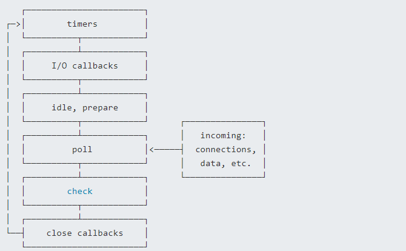

# Call Back

## What is Call back?

In Node.js, a callback is a function that is passed as an argument to another function and is executed after the completion of the operation in which it is passed. Callbacks are a fundamental part of asynchronous programming in Node.js, allowing you to run code after an asynchronous task, such as reading a file or making a network request, has completed.
在 Node.js 中，回调函数是一种作为参数传递给另一个函数的函数，并在该操作完成后执行。回调是 Node.js 异步编程的基本部分，它允许你在异步任务（如读取文件或进行网络请求）完成后运行代码。

## Advantages:

Asynchronous Operations: Callback functions allow you to perform time-consuming tasks (like I/O operations or network requests) without blocking the main thread, enhancing the responsiveness and performance of your program.

Simplified Code: By breaking operations into separate callback functions, your code structure can become more modular and clear, making it easier to maintain and reuse.

Flexibility: Callback functions can be passed as arguments, giving your code flexibility by allowing the behavior of functions to change dynamically based on the context.

优点：
异步操作：回调函数允许你在执行耗时任务（如I/O操作或网络请求）时不阻塞主线程，从而提高程序的响应性和性能。
简化代码：通过将操作分解为独立的回调函数，代码结构可以变得更加模块化和清晰，易于维护和复用。
灵活性：回调函数可以作为参数传递，赋予代码灵活性，使得函数行为可以根据上下文动态变化。

Node.js 异步编程的直接体现就是回调。
异步编程依托于回调来实现，但不能说使用了回调后程序就异步化了。
回调函数在完成任务后就会被调用，Node 使用了大量的回调函数，Node 所有 API 都支持回调函数。
例如，我们可以一边读取文件，一边执行其他命令，在文件读取完成后，我们将文件内容作为回调函数的参数返回。这样在执行代码时就没有阻塞或等待文件 I/O 操作。这就大大提高了 Node.js 的性能，可以处理大量的并发请求。

## Disadvantages:

Callback Hell: If callback functions are nested too deeply, the code can become difficult to read and maintain. This issue is commonly referred to as "callback hell" or the "pyramid of doom."


```javascript
asyncOperation1((result1) => {
    asyncOperation2(result1, (result2) => {
        asyncOperation3(result2, (result3) => {
            // More nesting...
        });
    });
});
```
Complex Error Handling: Handling errors in callback functions can be cumbersome, especially in chains of multiple callbacks, where error handling logic can easily be overlooked or mishandled.

Poor Readability: Callback functions can make the code flow less intuitive since the execution order doesn't match the written order of the code, making it harder to debug and understand.

Complex Control Flow: When program logic becomes complex, using callback functions for flow control can become confusing and difficult to manage.

Alternatives: To address these drawbacks, Node.js introduced Promises and async/await, which offer a more elegant way to handle asynchronous programming, reducing callback hell and simplifying error handling.

回调地狱：如果回调函数嵌套过深，代码会变得难以阅读和维护。这种情况通常被称为“回调地狱”或“回调金字塔”。

错误处理复杂：在回调函数中处理错误可能会很麻烦，尤其是在多个回调链中，错误处理逻辑容易被忽略或处理不当。

可读性差：回调函数可能会导致代码流变得不直观，因为执行顺序与代码的书写顺序不一致。这会让调试和理解代码变得更加困难。

控制流复杂：当程序逻辑变得复杂时，使用回调函数进行流程控制会变得混乱和难以管理。

替代方案：为了解决这些缺点，Node.js 引入了 Promises 和 async/await，它们提供了更优雅的异步编程方式，减少了回调地狱并简化了错误处理。

## Examples:

blocking code

```javascript
const fs = require('fs');

var data = fs.readFileSync('input.txt');console.log(data.toString());

console.log("program ending!!");
```

在这个例子中：
readFile 函数是一个同步函数，用于读取文件。在文件读取完后才执行完程序。

non-blocking code
```javascript
const fs = require('fs');

fs.readFile('input.txt', 'utf8', function (err, data) {
    if (err) return console.error(err);
    console.log(data.toString());
});
console.log("program ending!");
```

在这个例子中：
readFile 函数是一个异步函数，也是用于读取文件。
传递给 readFile 的第三个参数是一个回调函数。
一旦文件读取完成，回调函数会被调用，并带有两个参数：err 和 data。
如果发生错误，回调函数会处理它。如果没有错误，回调函数会处理文件的内容。
我们不需要等待文件读取完，这样就可以在读取文件时同时执行接下来的代码，大大提高了程序的性能。
这种模式有助于避免阻塞主线程，保持应用程序的响应性。

因此，阻塞是按顺序执行的，而非阻塞是不需要按顺序的，所以如果需要处理回调函数的参数，我们就需要写在回调函数内。


# Event Loop

## Introduction
Node.js is a JavaScript runtime environment based on an event-driven, non-blocking I/O model. Its efficiency largely depends on its event loop mechanism, which allows Node.js to handle a large number of concurrent operations on a single thread.

Node.js 是一个基于事件驱动、非阻塞 I/O 模型的 JavaScript 运行时环境。它的高效性主要依赖于其事件循环机制，这使得 Node.js 能够在单线程中处理大量并发操作。

## What is the Event Loop?
The event loop is the core mechanism in Node.js for handling asynchronous operations. It schedules the execution order of these operations and ensures that they are processed in an orderly manner in the task queue. The design of the event loop enables Node.js to efficiently manage I/O operations without blocking the main thread while waiting for I/O tasks to complete.

事件循环是 Node.js 中处理异步操作的核心机制。它负责调度异步操作的执行顺序，并确保这些操作在任务队列中有序执行。事件循环的设计使得 Node.js 能够高效地处理 I/O 操作，而不会因为等待 I/O 操作完成而阻塞主线程。

Node.js 的每一个 API 都是异步的，并作为一个独立线程运行，使用异步函数调用，并处理并发。
Node.js 基察本上所有的事件机制都是用设计模式中观者模式实现。
Node.js 单线程类似进入一个while(true)的事件循环，直到没有事件观察者退出，每个异步事件都生成一个事件观察者，如果有事件发生就调用该回调函数.

##  How the Event Loop Works
The event loop runs through different phases in a fixed sequence, with each phase responsible for handling specific types of callback functions. Here are the six phases of the event loop:

Timers:
    This phase executes callbacks scheduled by setTimeout and setInterval.

I/O Callbacks:
    This phase processes almost all I/O callbacks, except for close callbacks, timer callbacks, and setImmediate callbacks.

Idle, Prepare:
This phase is used internally and is typically not exposed to developers.

Poll:
    The poll phase is the core of the event loop. It retrieves new I/O events and will block here if there are no timer callbacks to execute, waiting for new events to arrive.

Check:
    This phase executes callbacks scheduled by setImmediate.

Close Callbacks:
    This phase handles close event callbacks, such as socket.on('close', ...).



调用栈（Call Stack）：当JavaScript代码开始执行时，会创建一个调用栈来跟踪正在执行的函数。每个函数都有自己的执行上下文，当函数被调用时，它的执行上下文被推入调用栈。当函数执行完毕，它的执行上下文从调用栈中弹出。
事件队列（Event Queue）：当异步操作（如文件I/O、网络请求等）完成时，相应的回调函数会被推入事件队列中等待执行。
事件循环：事件循环是Node.js的核心机制，它不断地从事件队列中取出事件，并将其对应的回调函数放入调用栈中执行。当调用栈为空时，事件循环会检查是否有新的异步操作完成，如果有，则将其回调函数推入事件队列。这个过程会持续进行，形成一个循环。

事件循环按照固定的顺序运行不同的阶段，每个阶段负责处理特定类型的回调函数。以下是事件循环的六个阶段：

Timers（定时器）：
    这一阶段执行 setTimeout 和 setInterval 调度的回调函数。

I/O Callbacks（I/O 回调）：
    这一阶段处理几乎所有的 I/O 回调，但不包括关闭的回调、定时器回调和 setImmediate 回调。

Idle, Prepare（空闲, 准备）：
    这一阶段仅供内部使用。

Poll（轮询）：
轮询阶段是事件循环的核心阶段。它会检索新的 I/O 事件；如果没有要处理的定时器回调，会一直阻塞在这里，直到有新的事件到来。

Check（检查）：
这一阶段执行 setImmediate 调度的回调函数。

Close Callbacks（关闭回调）：
这一阶段执行关闭事件的回调函数，如 socket.on('close', ...)。


# Microtasks and Macrotasks

In the event loop, tasks are divided into microtasks and macrotasks. Understanding the execution order of microtasks and macrotasks is crucial for mastering the behavior of the event loop.

Microtasks: Include process.nextTick and Promise callbacks. Microtasks are executed immediately after the current phase's callbacks have completed.

Macrotasks: Include setTimeout, setInterval, setImmediate, and I/O callbacks. These are scheduled for execution in different phases of the event loop.

在事件循环中，任务可以分为微任务（Microtasks）和宏任务（Macrotasks）。了解微任务和宏任务的执行顺序对于掌握事件循环的行为非常重要。

微任务（Microtasks）：包括 process.nextTick 和 Promise 的then回调。微任务会在当前阶段的所有回调执行完毕后立即执行。

宏任务（Macrotasks）：包括 setTimeout、setInterval、setImmediate 和 I/O 回调。它们会被调度到事件循环的各个阶段中执行。

微任务对应有：
    next tick queue：process.nextTick
    other queue：Promise的then回调、queueMicrotask

宏任务对应有：
    timer queue：setTimeout、setInterval
    poll queue：IO事件
    check queue：setImmediate
    close queue：close事件

其执行顺序为：
    next tick microtask queue
    other microtask queue
    timer queue
    poll queue
    check queue
    close queue

```javascript
setTimeout(() => {
    console.log('Macrotask: setTimeout');
}, 0);

setImmediate(() => {
    console.log('Macrotask: setImmediate');
});

process.nextTick(() => {
    console.log('Microtask: process.nextTick');
});

Promise.resolve().then(() => {
    console.log('Microtask: Promise');
});

console.log('Main thread execution');
```


# EventEmitter

## What is an EventEmitter?
    In Node.js, the EventEmitter is a class that is part of the events module. It allows objects to subscribe to named events, emit events, and respond to events asynchronously. The EventEmitter provides a powerful way to decouple components in your application, allowing them to communicate through events rather than direct method calls.

    Key Concepts
        Event: An event is a signal that something has happened in your application. For example, a user clicking a button might trigger a "click" event.

        Listener: A listener is a function that is executed when an event is emitted. You can have multiple listeners for a single event.

        Emitting an Event: When an event is emitted, all listeners attached to that event are called in the order they were added.

        Event Loop: The event loop in Node.js continuously checks the event queue to determine if there are any events that need to be processed. When an event is emitted, its listeners are pushed onto the call stack and executed by the event loop.

    在 Node.js 中，EventEmitter 是 events 模块的一部分。它允许对象订阅命名事件、发出事件并异步响应事件。EventEmitter 提供了一种强大的方式来解耦应用程序中的组件，使它们通过事件而不是直接的方法调用进行通信。

    Node采用了事件驱动机制，而EventEmitter就是Node实现事件驱动的基础
    在EventEmitter的基础上，Node几乎所有的模块都继承了这个类，这些模块拥有了自己的事件，可以绑定／触发监听器，实现了异步操作
    Node.js 里面的许多对象都会分发事件，比如 fs.readFile 对象会在文件被打开的时候触发一个事件
    这些产生事件的对象都是 events.EventEmitter 的实例，这些对象有一个 eventEmitter.on() 函数，用于将一个或多个函数绑定到命名事件上

    关键概念
        事件：事件是信号，表示应用程序中发生了某些事情。例如，用户点击一个按钮可能会触发一个“点击”事件。

        监听器：监听器是一个函数，当事件被触发时，该函数会被执行。一个事件可以有多个监听器。

        触发事件：当事件被触发时，所有附加到该事件的监听器会按照添加的顺序被调用。

        事件循环：Node.js 中的事件循环持续检查事件队列，以确定是否有需要处理的事件。当事件被触发时，它的监听器会被推送到调用栈中，由事件循环执行。

## Examples

```javascript
const EventEmitter = require('events');
const myEmitter = new EventEmitter();

// Registering a listener for the 'event' event
myEmitter.on('event', () => {
  console.log('First listener');
});

myEmitter.on('event', () => {
  console.log('Second listener');
});

myEmitter.once('eventOnce', () => {
  console.log('This will only run once');
});

myEmitter.on('event2', (arg1, arg2) => {
  console.log(`Event with args: ${arg1}, ${arg2}`);
});

const callback = () => {
  console.log('Listener removed');
};

myEmitter.on('event3', callback);

// Emitting the 'event' event
myEmitter.emit('event');
myEmitter.emit('eventOnce');
myEmitter.emit('eventOnce');
myEmitter.emit('event2','test1','test2');
myEmitter.emit('event3');
myEmitter.removeListener('event3', callback);
myEmitter.emit('event3');
```

In this example:

    We first import the EventEmitter class from the events module.
    We then create an instance of EventEmitter called myEmitter.
    A listener is registered using the on() method, which listens for an event called 'event'.
    You can attach multiple listeners to a single event. They will be executed in the order they were registered.
    The on() method registers a listener that is called every time the event is emitted. If you want the listener to be called only once, use the once() method.
    When emitting an event, you can pass arguments to the listeners.
    You can remove listeners using the removeListener() or off() methods.
    Finally, we emit the 'event' event using the emit() method.

在这个示例中：
    首先，我们从 events 模块中导入了 EventEmitter 类。
    然后，我们创建了一个名为 myEmitter 的 EventEmitter 实例。
    使用 on() 方法注册了一个监听器，监听 'event' 事件。
    你可以将多个监听器附加到一个事件上。它们会按照注册的顺序执行。
    on() 方法注册一个每次事件被触发时都会调用的监听器。如果你希望监听器只调用一次，可以使用 once() 方法。
    触发事件时，你可以向监听器传递参数。
    你可以使用 removeListener() 或 off() 方法移除监听器。
    最后，我们使用 emit() 方法触发了 'event' 事件。

